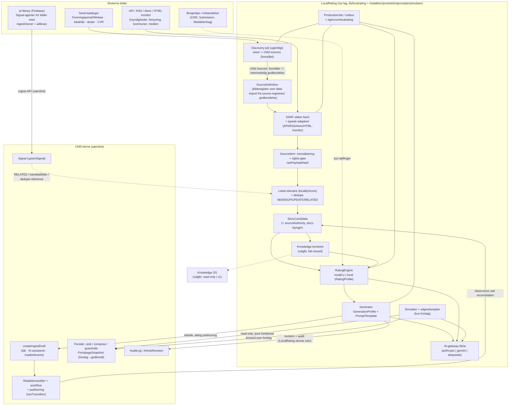

# 00 – Systemkort: CMS, Knowledge OS, Y Rating og hvor LocalRating sidder

Dato: 2. oktober 2026 (opdateret 3. oktober 2026: kilde-laget og kilderegistrene for Næstved/Slagelse, §5 og §5a). Status: Fase 0 (audit), kun dokumentation. Alle `fil:linje`-referencer er læst i koden på auditdagen; "uverificeret" markerer det jeg ikke har læst.

Kilder: `/Volumes/SSD Data/Gits/localcms/cms` (CMS), `/Volumes/SSD Data/Gits/knowledge-os` (kanonisk; `/Volumes/SSD Data/Gits/Knowledge` er forældet og ikke brugt), `/Volumes/SSD Data/Gits/SN-DeepDive` (Y Rating, read-only donor). Knowledge OS-MCP-serveren kunne ikke forbinde i denne session; Knowledge OS er derfor auditeret fra repoets filer, ikke mod en kørende instans.

---

## 1. De tre systemer i ét blik

| | CMS (`localcms/cms`) | Knowledge OS (`knowledge-os`) | Y Rating (`SN-DeepDive`) |
|---|---|---|---|
| Rolle | Redaktionelt cockpit: artikler, workflow, forside, brugere, multi-tenant (én kodebase, én by pr. `Instance`) | Fælles, permanent vidensdatabase/graf (source→document→chunk, entity, claim, concept, edge, agent_run, embeddings) | Donor: SIRE-rating, feed-ingest og artikelgenerator til mediet Y; Firebase |
| Stack | Next.js 16 (App Router), React 19, Prisma 6 (SQLite dev / Postgres prod via afledt skema), zod 4, next-auth 5, Redis valgfri (`package.json` `dependencies`) | Fastify + Postgres (`knowledge`-schema) + pgvector, MCP-server, React-UI i `web/` (`src/api/server.ts:1-30`) | Express på Firebase Functions v2 (`functions/src/index.ts:5-8,213-223`), Firestore, React/Vite-frontend |
| Tenancy | `instansId` på stort set alle tabeller; tenant udledes af `Host` (`getCurrentSite()`) og af brugerens `instansId` | **Ingen håndhævet isolation** (migration `012_ownership_foundation.up.sql` er kun "expand": tenant/instance/principal-tabeller + nullable ejerkolonner; ingen RLS-cutover, runtime er superuser; `docs/phase-0-integration-audit.md` §6) | Ingen (ét medie) |
| Auth | next-auth credentials, rettigheder som data (`lib/permissions.ts`, `Role.permissions`), `getAuthorizedUser()` (`lib/auth.ts:150`) | Delt `API_KEY`, `knowledge.api_client`-nøgler (scopes ignoreres), session-cookie til UI; åbent hvis intet er konfigureret (`src/api/server.ts:78-95`); MCP omgår HTTP-auth | **Ingen** (kun CORS-allowlist, `index.ts:24-36`) |
| AI | Anthropic via `lib/frontpage/ai-client.ts` + `/api/chat` | Gemini/OpenAI-adaptere (`src/core/llm.ts`, uverificeret detalje) | DeepSeek (primær) → Gemini 2.5 flash (fallback), Exa til research |
| Tests | `npm test` (isolerede SQLite pr. fil, 429 grønne pr. plan Del A) | `npm test` (isoleret PostgreSQL) | 49 tests, ikke på rating/feeds/dedupe (se `01-…` §Tests) |
| Persistens af rating/prompts | – | – | Ingen rating-historik, ingen prompt-versionering (localStorage/Firestore/fil) |

## 2. CMS – de moduler LocalRating støtter sig på (og ikke ændrer)

| Modul | Fil:linje | Hvad LocalRating bruger | Ændres? |
|---|---|---|---|
| Datamodel | `prisma/schema.prisma:18-68` (`Instance`), `:190-248` (`Article`), `:250-261` (`ArticleRevision`), `:422-457` (`Signal`), `:172-187` (`GeoTag`), `:107-120` (`AuditLog`) | Læser `Instance`/`GeoTag`; skriver `Article` kun via `createIngestDraft`; skriver `ArticleRevision`/`AuditLog` (kun inserts) | **Nej** (kun nye, additive tabeller) |
| Kladde-kontrakt | `lib/ingest/articles.ts:21-22` (`INGEST_DRAFT_STATUS="Idé"`, `INGEST_CONTENT_TYPE="AI-assisteret"`), `:44-59` (`buildBlocks`), `:61-133` (`createIngestDraft`) | Opretter kladde: status `Idé`, `AI-assisteret`, `aiBrug` påkrævet, kilder (`url`+`dato`), `marking={godkendtAf:"",kilder,maskinleveret:true}`, `provenance={ingestKeyPrefix,receivedAt,agent,kilder,signalIds,meta}`; spærrer politi/112-kildetyper (`:69-72`) og Krimi/Sundhed (`:79-81`); kræver `sektion` (`:75`); idempotent på `externalId` (`:65`) | **Nej** |
| Input-skema | `lib/ingest/schema.ts:13-28` (`SOURCE_TYPES`, `AI_RESTRICTED_SOURCE_TYPES`), `:91-115` (`articleSourceSchema`, `articleInputSchema`) | Genbruger typer og zod-skema som kontrakt for generatorens output | **Nej** |
| Signal-indtag | `lib/ingest/signals.ts:21-91` (`upsertSignal`), `lib/ingest/geo.ts:56-106` (`matchGeo`, `resolveGeoIds`, `POSTNR_TABLE`) | Genbruger `matchGeo` til geo-match; `Signal` er aI-librarys kanal og forbliver det | **Nej** |
| Workflow | `lib/workflow.ts:4-48` (19 statusser, `canTransition`) | Ingen kodesti til `Publiceret` fra LocalRating; redaktøren bruger eksisterende workflow | **Nej** |
| Mærkning/AI-regler | `lib/marking.ts:33-38,100-160` (`aiMarkingSchema`, `AI_USAGE_VALUES`, `isAiRestrictedCategoryTree`) | Håndhæves af `createIngestDraft`; LocalRating læser `AI_USAGE_VALUES` | **Nej** |
| Blokke | `lib/blocks/schema.ts:6-27` (8 bloktyper) | Generatorens output mappes til `paragraph/heading/subheading/quote/factbox` | **Nej** |
| Forside-kerne | `lib/frontpage/{rank,compose,guardrails,fallback,service,types,modules,layout-schema}.ts` | Simulatoren kalder de rene funktioner; "anvend som forslag" skriver `FrontpageSnapshot` | **Nej** (se `08-simulator-design.md` for hvad der mangler) |
| AI-klient | `lib/frontpage/ai-client.ts:13-153` | Mønster og testbar kontrakt (`AiTextClient`, `callJson`, timeout/retry); gateway'en i `lib/ai/` bygger oven på samme idéer, importerer ikke omvendt | **Nej** (`lib/frontpage/*` bliver ved med at virke uændret; gateway'en kan senere overtage Anthropic-kaldet, men det er ikke i scope) |
| Resilience | `lib/resilience.ts:162-178` (`getBreaker`, `isBreakerFailure`), `:128` (`backoffDelay`) | Breaker pr. provider (`ai:<provider>`), backoff | **Nej** |
| Rate limit | `lib/ratelimit/index.ts:166` (`rateLimit`), `lib/admin-guard.ts:18` (`guardAdminAction`) | Alle LocalRating-actions/routes | **Nej** |
| Cron-mønster | `app/api/cron/frontpage-rank/route.ts:21-59`, `docs/ops/RAILWAY-SETUP.md` §4 | Kopieres som mønster til `/api/cron/localrating` | **Nej** |
| Rettigheder/nav | `lib/permissions.ts:1-23`, `lib/default-roles.ts:9-18`, `lib/redaktion-access.ts:11-21`, `components/admin/nav-links.tsx:23-41`, `app/redaktion/layout.tsx:46` | Kun tilføjelser (nye konstanter, rolle-tildelinger, nav-linjer) | **Kun additive linjer** |
| Env/secrets | `lib/env.ts:42-55,127`, `scripts/check-secrets.ts:27`, `.env.example` | Kun tilføjelser af variabelnavne | **Kun additive linjer** |
| AI-operatør (under opbygning) | `lib/operator/{types,policy,prompt,confirm,events,sanitize,audit}.ts`, `lib/operator/tools/*`, `OperatorAction` (`schema.prisma:915`), `OPERATOR_USE` (`permissions.ts:26-27`) | LocalRating registrerer **værktøjer** i operatørens register (`defineTool`, risiko `read/safe-write/confirm`); `OPERATOR_PROMPT` registreres i prompt-biblioteket | **Nej** (kun nye filer i `lib/operator/tools/localrating/`; ét import-led i registret) |
| Hjælpere | `lib/validation/text.ts` (`stripHtml/cleanText/normalizeUrl:84`), `lib/slug.ts`, `lib/html-sanitize.ts`, `lib/validation/tokens.ts` (`sha256Hex`, `safeEqual`), `lib/audit.ts:19` (`writeAudit`) | Genbruges | **Nej** |

### Kendte CMS-forhold der påvirker designet (fundet i auditten)
1. `createIngestDraft` skriver **ingen** `ArticleRevision` og **ingen** `AuditLog` (`lib/ingest/articles.ts:93-118`). LocalRating gør det selv bagefter (ADR-001, `06-…` §5).
2. `provenance.meta` er begrænset til ≤ 20 skalarer à ≤ 500 tegn (`lib/ingest/schema.ts:54`); den kan derfor kun bære id'er (`storyCandidateId`, `generationRunId`), ikke segmentkort. Segment→blok-mapping bor i `GenerationRun`.
3. `Article.externalId` + `@@unique([instansId, externalId])` (`schema.prisma:240-245`) giver idempotens: LocalRating bruger `localrating:<generationRunId>`.
4. Bloktyperne har ingen felter til kilde-segmenter (`lib/blocks/schema.ts`): kildesporbarhed kan ikke ligge i selve blokkene uden at ændre `blockSchemas`. Beslutning: bevar blokkene uændret; bloks `id` (`ingest-1`, `ingest-2` … fra `buildBlocks`, `articles.ts:47`) er nøglen i `GenerationRun.segmentMap`.
5. **Hardcodet bynavn i kernen:** `lib/distribution-engine.ts:100` giver +15 til alle områder ≠ `"slagelse-by"`, og `:41,:53` hardkoder sektions-slugs `nyheder/sport/erhverv/debat/kultur`. Rammer `rankCandidates` (`lib/frontpage/rank.ts:49`) og dermed simulatoren i andre byer. Ikke i scope at rette (ingen refaktorering), men flaget som åbent spørgsmål (README nr. 5) – LocalRating-koden må ikke arve mønstret.
6. `calculateSupportedContentQuota` bruger `Date.now()` (`lib/frontpage-governance.ts:28`) – kvoten kan ikke aflæses "som på klokkeslæt X" (se `08-…`).
7. CMS kører `numReplicas: 1` (`cms/railway.json:12`), så en proces-lokal jobkø er acceptabel i v1, men claims skrives alligevel guardet (`updateMany` med statusbetingelse) så >1 replika ikke dobbeltkører.
8. De eksisterende "AI Library"-moduler (`app/actions/qa.ts:40-44`, `interview.ts:53`, `meddeler.ts:200-218`) kalder **ikke** en LLM: `aiOpsummering`/`aiStruktureret` er skabelontekst. CMS har derfor kun tre prompt-definitioner i dag (se `07-prompt-inventar.md`).

## 3. Knowledge OS – hvad der findes, og hvad der mangler for LocalRating

Fundet (verificeret i `README.md`, `src/api/server.ts`, `docs/phase-0-integration-audit.md`, `docs/adr/001-008`, `migrations/012*`, `clients/knowledge-client.ts`):

| Område | Status | Konsekvens for LocalRating |
|---|---|---|
| HTTP-API | `/knowledge/{save,ingest,search,context,ask,node/:id,sources,entities,claims,concepts,agent-runs,insights,graph,health,source-by-url,connect}` (`src/api/server.ts:97-254`); ingen versioneret kontrakt, ingen `getArticleContext`, ingen Story-/ExternalObjectRef-/Snapshot-endpoints, ingen skrive-API til AI-runs (`agent_run` logges internt) | v1 kan kun **læse kontekst** via `search`/`context` (valgfrit, bag feature-flag). Skrive-back (Article→Knowledge) er "Senere" |
| Tenant-isolation | Kun skema 012 ("expand only"); `knowledge.node` har nullable `owner_tenant_id/owner_instance_id/access_scope`; trigger sætter ejer fra `kos.owner_*`-settings; ingen principal/RLS i drift | Knowledge-kontekst må kun slås til for **én** fast instans (pilot), fail-closed klient. En 2. by kræver, at Knowledge OS' fase 3-5 (RLS + principal) er færdig (ADR-004, -011) |
| Dedupe | Global efter content hash; ændret indhold giver ny source (audit §5) | Kan lække på tværs af byer → LocalRating sender kun hash/URL-forespørgsler pr. instans, aldrig rå feed-tekst, før isolation findes |
| Klient | `clients/knowledge-client.ts:186,190-191,200-201`: `enabled = Boolean(baseUrl)`; uden URL returnerer alle kald `null`/`[]` **stille** | LocalRating bruger **ikke** denne klient direkte; `lib/localrating/context/knowledge.ts` er en egen, fail-closed adapter der skelner "slået fra" (ingen kontekst, markeret) fra "fejl" (ingen kontekst, markeret + logget) og aldrig opfinder kontekst |
| Events/outbox | Findes ikke; `job` er arbejdskø (ADR-008) | LocalRating har egen tabel-baseret outbox (ADR-012); ingen afhængighed |
| Ejerskabs-ADR'er | ADR 001-008 i Knowledge OS: Story≠Article (002), ExternalObjectRef (004), tenant (007), service-boundary (008) | LocalRatings ADR-003/-004/-011/-012 refererer og er kompatible; ingen konflikter |

## 4. Y Rating – donorens opbygning (verificeret)

> **Y fortsætter uændret.** Y Rating-repoet er read-only donor for en envejs engangsportering; det ændres, omdøbes, refaktoreres eller peges om aldrig af LocalRating-arbejdet (ingen synk, ingen delt pakke). Navnet LocalRating/Local Citation m.fl. findes kun i CMS-koden og -UI; Y-navnene bevares i Y.

- `functions/src/y-test-lab/sireRoute.ts` – **9.672 linjer**, ét Express-`Router` med ≥ 60 ruter (liste i `01-y-rating-reuse-matrix.md`). Delvis spejlet i frontend-mappen `SN-DeepDive/y-test-lab/` (**identisk** ved diff for `sireRoute.ts`, `businessArticleTypes.ts`, `taxonomy.ts`, `jsonRepair.ts`) – kun én kopi skal portes.
- `businessArticleTypes.ts` (1.307 l.), `taxonomy.ts` (324 l.), `jsonRepair.ts` (80 l.), `prompts/{sprogstil-base,aftenbrief,y-rubrikker}.ts`.
- Et **andet, mindre** feed-spor: `functions/src/server/services/{feedService,schedulerService,sourceService,externalArticleService,versioningService,clusteringService,scraperService,aiAttributionService,aiService}.ts` + `types/content-intelligence.ts` (Firestore; med `RightsLevel`). `schedulerService.ts:10-43` er sekventiel med in-memory `isRunning`; den planlagte `scheduledIngestion` (`index.ts:226-234`) returnerer tidligt ("DISABLED for testing", `:233-234`).
- Frontend: `YTestLab.tsx`, `YBusinessArticleGenerator.tsx`, `StoryWorkspace.tsx` (uverificeret i detaljer).
- Tests: 49 (`y-test-lab/*.test.ts`: 9+6+12+10+2+5+5), alle `node:test`; de importerer fra `./sireRoute` (som trækker Express/Firestore med) – portering kræver først at udtrække funktionerne.

## 5. Hvor LocalRating sidder – "lag ovenpå"



**Regler (ADR-001, ADR-003):** pile fra LocalRating til CMS-kernen er tilladt; **ingen pil går den anden vej** (kernen importerer aldrig `lib/localrating/**`, `lib/ai/**`, `lib/prompts/**` – undtagen nav-/rettighedslinjerne). `lib/prompts/` er det eneste nye modul kernen "tilmeldes": eksisterende filer får højst en eksport/registreringslinje uden adfærdsændring (se `07-…`).

**Tilføjelser efter ejerens præcisering:** (d) **kilderegistrene for Næstved og Slagelse** (`source-registries/`, 3. oktober 2026) er LocalRatings kilde-til-sandhed: kilder er data (`SourceDefinition` → `SourceItem` → lokal-relevans/dedupe → `StoryCandidate`), AI-opdagede kilder kræver menneskelig godkendelse, og rights følger `authorityLevel` (ADR-015; `10-…` §11); (a) LocalRating omfatter også **Local Arbejdsrum**, **Local Citation/Syntese/Business** og assistenter (funktionel paritet med Y-familien; `01-…` §0/§9) – alle ender som CMS-kladder via `createIngestDraft`; (b) **AI-operatøren** (under opbygning, `lib/operator/**`) kan oprette/udløse LocalRating-ting via værktøjsregistret (`04-…` §5) med samme guardrails; (c) **Y fortsætter uændret** – ingen pil går fra CMS'et til Y eller omvendt.

### 5a. Grænsen mellem aI-library og LocalRating (opdateret 3. oktober 2026 – D18)
**Før:** T7/T8 (`docs/review/T7-agent-integration-design.md`, `T8-kildematrix.md` §5) placerer **dagsorden, politi, trafik, vejr** hos aI-library (Cloud Scheduler → `POST /api/ingest/signals` → `Signal`) med klyngning og policy-filter; LocalRating ejede kun generiske feed-kilder, og en kilde der blev leveret via Signal-API'et blev ikke oprettet i LocalRating.

**Nu (kilderegistrene):** registrene er LocalRatings kilde-til-sandhed og indeholder netop politi, dagsordener, trafik og DMI som P0/P1-kilder. Reglen **"én kilde, ét system"** præciseres til **"én ingest-ejer pr. kilde"**: *kilderegistret* (hvad der overvåges, autoritet, rights, godkendelse) **ejes af LocalRating**; *hentningen* af en given kilde ejes af enten LocalRating eller aI-library (`SourceDefinition.ingestOwner`). aI-library kan fortsat levere `Signal` for de kilder den allerede dækker; LocalRating poller dem ikke, men registrerer dem og bruger deres `Signal`s som kandidatkilde (`origin="signal"`), `RELATED`-evidens og dedupe-reference. Ingen dobbelt-ingest: konkret dedupe-regel, ejerskifte-checklist og drift-vagt står i `04-…` §4a. Default ved import er `ailibrary` for politi, dagsordener, Vejdirektoratet og DMI indtil ejeren afgør D18 pr. kilde; aI-library ændres ikke.

## 6. Overlap, huller og beslutninger (spec Fase 0, punkt 3-4)

| # | Overlap/hul | Konsekvens | Beslutning |
|---|---|---|---|
| O1 | To rating-/scoring-systemer ville opstå (Y + CMS' `distribution-engine` til *post*-publication) | Spec §31: ingen blanding af pre-/post-publication | LocalRating = *pre-publication* (Editorial Rating). `distribution-engine`/forside = *post-publication* og røres ikke (ADR-006) |
| O2 | Y har tre AI-wrappers + `aiService.ts`; CMS har én Anthropic-klient i `lib/frontpage/ai-client.ts` | Tre kodestier med samme fejl | Ét `lib/ai/`-gateway (ADR-007); `lib/frontpage/*` uændret i denne leverance |
| O3 | Y's og CMS' URL-normalisering er forskellig (`server/utils/url.ts:1-35` vs. `lib/validation/text.ts:84-100`) | Dedupe mod `Signal.kildeUrlNorm` kræver samme normalisering | CMS-versionen vinder (REPLACE) |
| O4 | `RightsLevel` findes kun i Y's legacy-model og er ikke håndhævet (`feedService.ts:86` kopierer blot værdien) | Juridisk risiko | Håndhæves i pipeline (ADR-008); nu også **afledt af `authorityLevel`+`licenseType`** og styret af godkendelsesflow (ADR-015) |
| O5 | To kilde-ingest-spor (aI-library `Signal` og LocalRating `SourceItem`) kan komme til at hente samme kilde | Dobbelt-ingest, dobbelt GDPR-behandling, dubletkandidater | `ingestOwner` pr. kilde + envejs dedupe-regel + drift-vagt (`04-…` §4a); kilderegistret ejes af LocalRating (ADR-015) |
| G1 | Ingen job-kø i CMS | AI-trin > request-timeout | `ProductionJob` + cron (ADR-005, -012) |
| G2 | Ingen usage-/cost-måling nogen steder | Delt global nøgle uden loft | `AiUsage` + månedsloft pr. instans (ADR-007) |
| G3 | Ingen prompt-register; kun 3 prompt-konstanter i kode | Ejeren kan ikke se/versionere prompts | `lib/prompts/` + `/redaktion/prompter` (ADR-009) |
| G4 | Knowledge OS har ingen tenant-isolation og ingen Story/ExternalObjectRef/`getArticleContext` | Kontekst kan ikke bruges for flere byer | Valgfri, feature-flag, én instans, fail-closed (ADR-004) |
| G5 | Ingen RSS/XML-parser og ingen SSRF-sikker fetch i CMS (`package.json` har hverken `rss-parser`, `cheerio`) | Ny afhængighed (≥ `rss-parser`; `cheerio` kun til feed-discovery) | Tilføjes i Fase 2 (ejergodkendt afhængighed) |
| G6 | Ingen revision/audit ved agent-kladder | Sporbarhed | LocalRating skriver `ArticleRevision` + `writeAudit` oven på `createIngestDraft` |

## 7. Dataflow – hændelsesforløb (sekvens)

```mermaid
sequenceDiagram
  autonumber
  participant Cron as Railway cron (5 min)
  participant LR as /api/cron/localrating
  participant J as ProductionJob
  participant F as safeFetch + parser
  participant DB as LocalRating-tabeller
  participant AI as AI-gateway
  participant CMS as createIngestDraft / editor
  Cron->>LR: POST Bearer CRON_SECRET
  LR->>J: claim forfaldne SourceDefinition → FETCH_FEED (dedupeKey)
  J->>F: hent (ETag/If-Modified-Since, SSRF-regler, robots) – kun godkendte, aktiverede kilder med ingestOwner=localrating
  F->>DB: SourceItem (rå payload + rawPayloadHash) + IngestionLog
  DB-->>J: event FEED_ITEM_INGESTED → job PROCESS_ITEM
  J->>DB: normalisér + localityScore + dedupe (inkl. Signal) → StoryCandidate (NEW/UPDATE/RELATED; sourceAuthority, klynger) eller DUPLICATE/filtered
  DB-->>J: event STORY_CANDIDATE_CREATED → job RATE_CANDIDATE
  J->>AI: estimér delscorer (kun AI-felter) – AiUsage
  J->>DB: RatingRun (delscorer + total + bånd + A/B/C-forslag)
  Note over DB: Redaktør åbner inbox, accepterer kandidat
  DB->>J: job GENERATE_DRAFT (kræver production.ai.use)
  J->>AI: generér (SYSTEM / BRUGER / HENTET INDHOLD adskilt) → guardrails → faktatjek
  J->>CMS: createIngestDraft (Idé · AI-assisteret · kilder m. dato)
  J->>DB: ArticleRevision + AuditLog + GenerationRun.articleId
  CMS-->>DB: (reconciliation) observér artikelstatus → candidate published
```

## 8. Hvad der IKKE må ændres (kort liste – fuld liste i ADR-001)

`Article`, `Signal`, `Instance`, `GeoTag`-skemaerne; `lib/ingest/**`; `lib/workflow.ts`; `lib/marking.ts`; `lib/blocks/**`; `lib/frontpage/**`; `lib/distribution-engine.ts`; `app/api/chat/route.ts`; auth/rate limit/audit; eksisterende ruter. Kun additive linjer i permissions, default-roller, redaktion-access, nav-links, layout-gating, env, check-secrets, `.env.example` og `RAILWAY-SETUP.md`.
