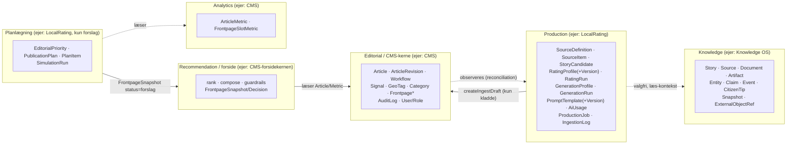

# 02 – Data ownership og bounded contexts

Dato: 2. oktober 2026. Status: Fase 0. Grundlag: master-spec §2, §3, §26, §28, §31 og planens Del B ("lag ovenpå"). Knowledge OS' egne ADR'er (`knowledge-os/docs/adr/001-008`) er kompatible; se tværreferencer.

## 1. Bounded contexts

**Afhængighedsretning (ADR-003):** `LocalRating → CMS-kerne`, aldrig omvendt. Kernen importerer ikke `lib/localrating/**`, `lib/ai/**`, `app/redaktion/produktion/**`. De eneste kerne-filer der får linjer om LocalRating er nav, rettigheder, env/secrets (additive). `lib/prompts/` er et fælles modul som kernen kan *tilmelde* sine eksisterende prompts til (kun eksport/registreringslinje – ingen adfærdsændring; `07-…`).

## 2. Ejerskabstabel

| Objekt | Ejer | Må LocalRating skrive? | Hvordan | Master-spec | Bemærkning |
|---|---|---|---|---|---|
| `Article`, `ArticleRevision`, workflow-status, publicering | CMS (editorial) | **Kun oprette kladde** + indsætte revision | `createIngestDraft` (`lib/ingest/articles.ts:61`) + `ArticleRevision.create` + `writeAudit` | §2 "Editorial/CMS ejer Article" | Aldrig status ud over `Idé`; ingen kodesti til `Publiceret` (jf. `articles.ts:15-19`) |
| `Signal` | CMS (ingest-API, aI-library) | **Nej** (kun læse til dedupe/RELATED/kandidatkilde) | – | – | **Én ingest-ejer pr. kilde** (`SourceDefinition.ingestOwner`; `00-…` §5a, `04-…` §4a): LocalRating ejer kilderegistret, aI-library kan fortsat levere Signal |
| `GeoTag`, `Category`, `Instance` | CMS | **Nej** (kun læse) | `lib/ingest/geo.ts` | §5 "scope" | LocalRating gemmer id'er (`geoTagIds`), ikke kopier af navne |
| `SourceDefinition`, `SourceItem`, `SourceDiscoveryRun`, `LocalEntityRef`, `StoryCandidate`, `RatingProfile`, `RatingRun`, `GenerationProfile`, `GenerationRun`, ingestion-state | **LocalRating** (Production) | Ja | egne tabeller | §2 "Production Engine ejer" | `NormalizedItem` er ikke en tabel i v1: normalisering gemmes som `SourceItem.normalized` (Json) |
| `LocalWorkspace` (Local Arbejdsrum), `AssistantRun` | **LocalRating** | Ja | egne tabeller | §13 (generering) | Arbejdsrummet er et skrive-/chatværksted, ikke en artikeleditor; `Article` oprettes kun ved hand-over |
| `OperatorAction` (AI-operatørens bekræftelser/fortryd) | **CMS (operatør-sporet)** | **Nej** (kun via værktøjer i registret) | `lib/operator/**` | – | LocalRating-værktøjer er *klienter* af operatøren; de ejer ikke tabellen |
| `PromptTemplate(+Version)` | **LocalRating** (ejer data) / `lib/prompts` (register) | Ja | – | §13 "Prompts versioneres" | Kerne-prompts i kode er ikke i DB (read-only visning) |
| `AiUsage`, `ProductionJob`, `IngestionLog` | **LocalRating** | Ja | – | §25 (events), §30 | Teknisk/drift; tilhører ingen forretningskerne |
| `EditorialPriority` (A/B/C) | **CMS' domæne i spec'en (§2)**, men i denne leverance implementeret som LocalRating-tabel | Ja (additiv tabel) | – | §2 "Editorial/CMS ejer … EditorialPriority", §11 "endelig A/B/C vælges i CMS'et" | Afvigelse fra spec'en: tabellen oprettes af LocalRating fordi kernen ikke må ændres. Datamodellen er uafhængig af LocalRating (`articleId` + instans) og kan senere flyttes ind i kernen uden dataændring (åbent spørgsmål README nr. 9) |
| `PublicationPlan`, `PlanItem`, `SimulationRun` | LocalRating | Ja | – | §2 "Recommendation ejer SimulationRun" | Spec'en placerer `SimulationRun` hos Recommendation; kernen har ingen recommendation-tabeller ud over `Frontpage*`. LocalRating ejer dem som *forslagsdata*; `FrontpageSnapshot` forbliver kernens |
| `FrontpageSnapshot/Decision/Layout` | CMS (forsidekerne) | **Kun indsætte forslag** (`status="forslag"`) | direkte `db.frontpageSnapshot.create` i transaktion (se `08-…` §7) | §15-§23 | Aldrig `godkendt`; godkendelse sker i eksisterende forsideeditor (`approveSnapshot`, `service.ts:280`) |
| `Story`, `Source`/`Document`/`Artifact`, `Entity`, `Claim`, `Event`, `CitizenTip`, `Snapshot`, `ExternalObjectRef` | **Knowledge OS** | **Nej i v1** | Kun læsning af kontekst via adapter | §2 "Knowledge OS ejer", §3 | Write-back (Article→Knowledge, ExternalObjectRef) er "Senere" og kræver Knowledge OS' egen plan |
| Analytics (`ArticleMetric`, `FrontpageSlotMetric`) | CMS | **Nej** (kun læse til simulator/shadow) | – | §24 | |
| Brugere/roller | CMS | **Nej** | Kun nye rettighedskonstanter | – | |

## 3. Story ≠ Article (ADR-004)

- **Article** = en konkret CMS-publicering (`Article`), ejet af CMS.
- **Story** = den længerevarende journalistiske sag, ejet af Knowledge OS (`knowledge-os/docs/adr/002-story-article.md`).
- **StoryCandidate** (LocalRating) er *hverken* Story eller Article: det er et *pre-publication-objekt* ("noget systemet mener potentielt kan blive journalistisk indhold", spec §9). Det kan pege på en Knowledge-Story (`storyRef`, valgfri) og på en CMS-artikel (`articleId`), men er egen identitet. En kandidat bliver aldrig automatisk en artikel (spec §28 "SourceItem bliver aldrig automatisk Article"): artikel opstår kun via `GENERATE_DRAFT` → `createIngestDraft` efter menneskelig accept.
- Navngivning i kode/UI: "Kandidat" (ikke "historie") for at undgå forveksling med Story.

## 4. Source ≠ Artifact (ADR-003/-004; Knowledge ADR-003)

- **SourceDefinition** (LocalRating; hed `FeedSource` før kilderegistrene) = en *informationskilde-konfiguration* og **kilderegisteret som data** (URL/endpoint, `accessMode`, `authorityLevel`, prioritet, rettigheder, geo-/entitetsfilter, polling, godkendelse). Ejerens to kilderegistre (`source-registries/`) er kilde-til-sandhed for *hvad der overvåges*; databasen for *hvad der er godkendt og tændt* (ADR-015). Den svarer til Knowledge OS' `Source`-begreb ("en kommune, en person eller et website") — ikke til en fil. `SourceDefinition.knowledgeSourceRef` kan pege på en Knowledge `Source` (valgfri, spec §8).
- **SourceItem.rawPayload** = rå input, bevaret til audit og reproducerbarhed (spec §8) – *ikke* et Knowledge `Artifact` (tekniske filer: CSS/PDF/HTML). I v1 opretter LocalRating ingen Artifacts; Knowledge-integrationen er read-only.
- En kommunes dagsorden-PDF vil i Knowledge OS være `Artifact` under en `Document` under en `Source`; i LocalRating er den højst en `SourceItem.url`.

## 5. ExternalObjectRef

Knowledge OS' `ExternalObjectRef` (`system`, `type`, `externalId`, `versionId?`, `instanceId?`) er ikke implementeret endnu (`knowledge-os/docs/adr/004-external-object-ref.md`: besluttet, ikke bygget). LocalRating forbereder kun **stabile, eksternt refererbare id'er**:

| LocalRating-objekt | Stabilt id (til fremtidig ExternalObjectRef) | Bemærkning |
|---|---|---|
| `StoryCandidate` | `StoryCandidate.id` (cuid, aldrig genbrugt) | `system="localrating"`, `type="story_candidate"` |
| `GenerationRun` | `GenerationRun.id` | bærer `promptVersionIds`, `model`, kilder |
| CMS-artikel | `Article.id` (+ `ArticleRevision.id` som versionId) | `system="cms"`, `type="article"` |
| SourceItem | `(sourceId, externalId)` | idempotent nøgle |

Ingen kode i v1 kalder `registerExternalObject`. Når Knowledge OS har endpoints, tilføjes en `EVENT`-handler (ADR-012) uden skemaændring.

## 6. Provenance gennem kæden (spec §31 "miste provenance")

`SourceDefinition` → `SourceItem` (rå payload, hash, URL) → `StoryCandidate.sourceRefs` → `RatingRun` (inputHash, profil-/modelversion) → `GenerationRun` (`inputRefs`, `promptVersionIds`, `model`, `segmentMap`) → `Article.provenance` (`kilder[{url,dato,titel,udgiver,sourceType}]`, `agent{name,version,runId}`, `meta{storyCandidateId,generationRunId,ratingRunId,promptVersion,model}`) → (senere) Knowledge `ExternalObjectRef`.

AI må **aldrig** overskrive original provenance: `SourceItem.rawPayload` og `RatingRun.features` er append-only (ingen `update` af payload; `UPDATE`-dedupe opretter ny revision i `SourceItem.revision`, bevarer `prevContentHash`). `GenerationRun.result` er uforanderlig efter `generated`; faktatjek og guardrails skriver separate felter (`factCheckReport`, `guardrailReport`).

## 7. Tenant-scope (ADR-011)

- Hver LocalRating-tabel har `instansId String` (+ indeks). Tenant kommer **altid** fra den indloggede bruger/cron-parameter – aldrig fra klient-input (samme regel som `lib/frontpage/service.ts:20-25`).
- Fremmed id ⇒ "findes ikke" (ikke "ingen adgang").
- Delte globale data findes ikke i LocalRating v1 (ingen `instansId = null`-rækker): standardprofiler og -prompter *seedes pr. instans* ved aktivering (`03-…` §0), så ingen tenant kan se/ændre en anden tenants versioner.
- `instansId` har **ikke** Prisma-relation til `Instance` (samme mønster som `AuditLog`, `schema.prisma:105-120`) for at holde `Instance`-modellen uændret; i stedet sikres tenant-konsistens mellem LocalRating-tabeller med sammensatte fremmednøgler `(instansId, id)` (se `03-…`). Test: eksplicitte cross-tenant-tests (`11-…`).
- Knowledge-kontekst må kun aktiveres for én fast instans, indtil Knowledge OS har RLS/principal (ADR-004).

## 8. Hvad "ejerskab" betyder for ændringer

| Ønske | Hvor det hører hjemme | Hvem skal godkende |
|---|---|---|
| Ny ratingdimension / ny vægt / ny tærskel | Ny `RatingProfileVersion` (data) | `production.manage` (redaktionsleder) – kræver ikke kodeændring, med mindre en *ny deterministisk formel* er nødvendig (ny `modelVersion`) |
| Ny prompttekst | Ny `PromptTemplateVersion` | `prompts.edit` |
| Ny artikelgenre | Ny `GenerationProfile` | `production.manage` |
| Ny feed | `SourceDefinition` | `production.manage`; at hæve `rightsLevel` over `metadata_only` (eller sætte `licensed`) kræver `production.rights.manage` (kun Ansvarshavende redaktør som standard; `10-…` §4) |
| Ny regel for forsidens placering | Eksisterende `lib/frontpage/*` | Uden for LocalRating-scope |
| Ny AI-provider | `lib/ai/providers/*` | Udvikler + ejer (GDPR) |
