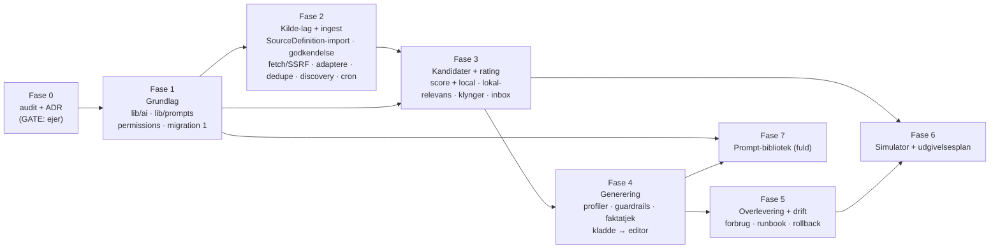

# 12 – Implementeringsrækkefølge (Fase 1-7)

Dato: 2. oktober 2026 (opdateret 3. oktober 2026: kilderegistre ⇒ Fase 2/3-omfang, D6 besvaret, D29-D32). Status: Fase 0 (forslag). Intet af dette startes før ejerens godkendelse af Fase 0 (gate, `README.md`). Omfang angives som **S/M/L** (relative; grov tommelfingerregel: S ≈ 1-3 arbejdsdage, M ≈ 4-8, L ≈ 9-20 for én udvikler inkl. tests og dokumentation – **estimat, ikke løfte**). Fasenummer og rækkefølge følger planens Del B; afvigelser står i `README.md`.

## 1. Overblik og afhængigheder

Kritisk sti: F0 → F1 → F2 → F3 → F4 → F5. **F6** kan *tidligst* starte efter F3 (kræver `RatingRun`/kandidater til input), men bør først starte efter F5 (stabil drift). **F7** kan løbe parallelt med F5/F6 (kun UI/versionering ovenpå F1/F4).

**Operatør-værktøjer og chat-UI følger faserne (ejerens tilføjelse):** hver fase afsluttes med at registrere sine værktøjer i AI-operatørens register (liste og risikoniveau pr. værktøj: `04-…` §5.1; spor S8) – Fase 1 `lr_status/lr_usage/prompts_*` (read), Fase 2 feeds, Fase 3 kandidater/rating/Local Lab, Fase 4 arbejdsrum/generering/assistenter/hand-over, Fase 5 drift, Fase 6 simulator/planer, Fase 7 playground. Delte chat-komponenter (`components/chat/**`, skillet `chat-module`, `04-…` §6) bygges **i Fase 1** (så operatør, arbejdsrum og playground deler dem).

## 2. Faser

### Fase 1 – Grundlag (M-L)
**Leverancer:** (0) delte chat-komponenter `components/chat/**` (skillet `chat-module`) + operatørværktøjer `lr_status`, `lr_usage`, `prompts_list/get`; (1) migration `localrating_foundation` (`03-…`), `prisma validate` af sammensatte FK'er; (2) `lib/ai/` (gateway, providers, usage, pricing, budget, json-repair, fakes); (3) `lib/prompts/` (registry, kerne-prompt-deskriptorer, præambel) + **`/redaktion/prompter` read-only** med de 4 kerne-prompts; (4) permissions/nav/env/secrets; (5) tests.
**Filer – nye:** `cms/lib/ai/**`, `cms/lib/prompts/**`, `cms/app/redaktion/prompter/**`, `cms/prisma/postgres/migrations/*_localrating_foundation/**`, `cms/tests/{ai-*,prompts-*,localrating-migration-additive,localrating-import-direction,localrating-no-public-keys}.test.ts`.
**Filer – kun additive linjer:** `cms/prisma/schema.prisma` (+ afledt `prisma/postgres/schema.prisma`), `cms/lib/permissions.ts` (nye konstanter), `cms/lib/default-roles.ts`, `cms/lib/redaktion-access.ts`, `cms/components/admin/nav-links.tsx`, `cms/app/redaktion/layout.tsx` (gating-prop), `cms/lib/env.ts`, `cms/scripts/check-secrets.ts` (+ `tests/check-secrets.test.ts`), `cms/.env.example`, `docs/ops/RAILWAY-SETUP.md`. *Valgfrit (kræver ok):* `cms/lib/chat.ts` + `cms/app/api/chat/route.ts` (`chatSystemPrompt`-udtræk).
**Afhængigheder:** Fase 0-godkendelse. **Parallelt (filejerskab):** WP1a skema+migration (1 ejer af `schema.prisma`); WP1b `lib/ai/**` (rene moduler, fakes – uafhængig af DB); WP1c `lib/prompts/**` + prompter-UI (kerne-del uafhængig; DB-del efter WP1a); WP1d permissions/nav/env/secrets (1 ejer af de delte additive filer).
**Ejer-beslutninger:** D2, D3, D4, D5, D9 (ingen ny afhængighed i F1), D10, D15, D16, D19.

### Fase 2 – Kilde-laget: `SourceDefinition`-import + feeds/API-adaptere for MVP-kilder (L → XL; opdelt 2a-2d)
**Omfang (opdateret efter kilderegistrene):** Fase 2 bygger *kilde-laget*: kilderegistret som data (import af Næstved- og Slagelse-registrene), godkendelsesflow, ingest via typede adaptere for MVP-kilderne, og discovery. Rækkefølge og bølger (A-F): `10-…` §11g.
**Leverancer:** SSRF-sikker `safeFetch` + robots; 3-lags parser; normalisering + rights-gate + kvalitetsgate; URL-kanonisering/hashes/dedupe (NEW/DUPLICATE/UPDATE/RELATED, inkl. `signal`-regel, `04-…` §4a); oversættelse/resumé (cachet pr. hash); **`SourceDefinition`/`SourceItem`** (migration `localrating_foundation`) + **`localrating_sources`** (`SourceDiscoveryRun`, `LocalEntityRef`); **`npm run sources:import`** (tørkørsel, overlay, revert) og **`sources:check`** (robots/aiHostile/feed-discovery); **godkendelsesflow** (`/redaktion/produktion/kilder`, D29); **adaptere for MVP-kilder** (`rss-parser`/`atom`, `html-change`/`html-list`/`pdf-monitor`, `wfs`, `odata`, `json-api`, senere `gtfs`/`datex2`/`cvr`); **forfilter-udgave af `scoreLocality`** (så nationale kilder ikke fylder databasen); **discovery-jobbet** `discoverSources` + seed-adaptere (2d); cron-endpoint (P0-reservation, `10-…` §11f) + Railway-cron-opskrift; `ProductionJob`/outbox (jobs, claim, lease, reaper, events); Y-importværktøj (sekundært, valgfrit).
**Delfaser:** **2a** `fetch`/robots/parser/normalisering/rights/dedupe/jobs/cron + `SourceDefinition`-CRUD + `sources:import`/`check` + godkendelseskø (kilder er `foreslået`/`enabled=false`); **2b** bølge A (rene feeds/åbne sider, adaptere `rss`/`atom`/`html-*`/`wfs`) + bølge B (åbne API'er); **2c** bølge C-D efter D30/D31 (CVR, Rejseplanen, Vejdirektoratet, retslister …); **2d** bølge E (seed-adaptere + discovery + alias-forslag). Bølge F (Ritzau-licens) når aftale foreligger.
**Filer – nye:** `cms/lib/localrating/{fetch,robots,feed-parser,feed-discovery,normalize,feed-quality,dates,rights,urls,dedupe,translate,feeds,ingest,pool,jobs,events,cron,locality}.ts`, `cms/lib/localrating/sources/{registry-parser,access-rules,rights-defaults,import,check,approve,discover,entities}.ts`, `cms/lib/localrating/sources/adapters/*.ts`, `cms/app/redaktion/produktion/{layout?,feeds/**,kilder/**}`, `cms/app/api/cron/localrating/route.ts`, `cms/scripts/{sources-import,sources-check,localrating-import-y-feeds}.ts`, `cms/tests/localrating-{fetch-ssrf,feed-parser,dedupe,rights,jobs,cron,registry-parser,source-rights,source-approval,source-discovery,ingest-owner,locality}.test.ts` + fixtures (inkl. udsnit af de to registre). **Additive:** `package.json` (`rss-parser`; `cheerio` for HTML_MONITOR/discovery; evt. PDF-parser), `docs/ops/RAILWAY-SETUP.md` (§ cron-localrating), `scripts/check-secrets.ts` (overlay-regel). **Uændret:** `docs/localrating/source-registries/*.md` (ejerens filer).
**Afhængigheder:** Fase 1 (tabeller, gateway til oversættelse/triage, permissions). **Parallelt:** WP2a `fetch.ts`+`robots.ts` (+SSRF-suite); WP2b `feed-parser.ts`+`normalize.ts`+`feed-quality.ts`+`dates.ts`+`rights.ts`; WP2c `dedupe.ts` (efter WP2b's `NormalizedItem`-type); WP2d `jobs.ts`/`events.ts`/`cron.ts` + route (uafhængig); WP2e kilder-UI (efter WP2a/b/d-kontrakter, kan mockes); WP2f `sources/registry-parser`+`access-rules`+`rights-defaults`+`import` (rene, testes mod de to registerfiler uden DB); WP2g adaptere pr. `parserType` (én ad gangen, hver med fixtures); WP2h discovery + seed-adaptere (efter WP2e).
**Ejer-beslutninger:** ~~D6~~ (besvaret: Næstved OG Slagelse, `10-…` §11g), D7 (juridisk rights-gennemgang), D9 (`rss-parser`/`cheerio`/PDF), D18 (ingest-ejer pr. kilde), **D29** (godkendelsesflow), **D30** (accessMode, licens-/API-aftaler), **D31** (persondata), **D32** (hvilke kilder aktiveres først).

### Fase 3 – Kandidater og rating (L)
**Leverancer:** **Local Lab** (`/redaktion/produktion/lab`: rate indsat tekst/URL/fil med Local Score, feed-browser, hurtig score) ; `StoryCandidate` + migration 3 (`localrating_candidates_rating`; inkl. `localityScore`, `sourceAuthority`, klynge-felter, `primaryFirst`); kandidat-dannelse fra `SourceItem`s (inkl. `RELATED`/`UPDATE`) og fra `Signal`s af `ailibrary`-ejede kilder; **lokal-relevans og story-klynger:** fuld `scoreLocality` (alle signaler L1-L12, kalibrering), `localSignal`/`sourceAuthority`/`clusterStrength` i `local`-modellen (`05-…` §5.1b), `LocalEntityRef`-vedligehold (godkendelse, CVR-/DAWA-populering), klynge-profildata for pilotbyerne, metrik "primærdata før sekundære medier" (I21); `RatingModel`-grænseflade + **`score`** (Local Score, porteret, golden-tests) + **`local`** (ny); `RatingProfile`/`Version` + `rescore`; sammenligning y/local; deterministiske features (geoFit, sourceQuality, duplication, tipSupport …); Knowledge-adapter (valgfri, fail-closed); **`/redaktion/produktion`** (inbox) + kandidat-detalje.
**Filer – nye:** `cms/lib/localrating/{candidates,taxonomy}.ts`, `cms/lib/localrating/context/knowledge.ts`, `cms/lib/localrating/rating/**`, `cms/app/redaktion/produktion/{page.tsx,kandidater/[id]/**}`, `cms/tests/localrating-{rating-*,taxonomy}.test.ts`. **Additive:** `schema.prisma` (migration 2).
**Afhængigheder:** Fase 1 (gateway, registry), Fase 2 (SourceItems, dedupe, jobs). **Parallelt:** WP3a `rating/models/score.ts` + golden (rent, kan starte allerede efter Fase 1); WP3b `rating/models/local.ts` + features (rent); WP3c `candidates.ts` + `engine.ts` (efter 3a/3b-interface); WP3d Knowledge-adapter; WP3e inbox/detalje-UI (efter 3c).
**Ejer-beslutninger:** D14 (Knowledge-kontekst til/fra), kalibrering/"gold"-sæt (redaktion; nu også `localityScore`-vægte og klynger), D11, D32 (hvilke kilder der er aktive som rating-input).

### Fase 4 – Generering og Local-familiens paritetsfunktioner (L → XL; opdelt 4a-4e)
**Leverancer:** `GenerationProfile` (7 lokale + 10 Local Business-typer + Local Citation/Syntese) + `PromptTemplate` DB-prompts (basis-redigering, versionshistorik, aktivér; playground-begyndelse); generator (stream + job); guardrails + faktatjek **med porterede tests**; kladde via `createIngestDraft` + `ArticleRevision` + audit; kildesporbarhedsvisning; migration 3.
**Filer – nye:** `cms/lib/localrating/generate/**`, `cms/app/api/localrating/generation/[id]/events/route.ts`, `cms/app/redaktion/produktion/kandidater/[id]/generer/**`, `cms/tests/localrating-{draft-contract,provenance,guardrails-*,generation-profiles,factcheck}.test.ts`. **Additive:** `schema.prisma` (migration 3).
**Afhængigheder:** Fase 3 (kandidater/rating), Fase 1 (gateway + DB-prompts). **Parallelt:** WP4a guardrails + porterede tests (rene; kan starte tidligt efter udtrækning fra `sireRoute.ts`); WP4b profiler + prompt-seed; WP4c pipeline/stream/job; WP4d faktatjek; WP4e hand-over (`to-draft.ts`, kladde-kontrakt-suite); WP4f UI.
**Ejer-beslutninger:** D11 (Local Business-profiler/klumme), faktatjek-udbyder, `extraSources`.

**Paritetsopdeling (ejerens tilføjelse: funktionel paritet med Y-familien, omdøbt til Local; `01-…` §0/§9):**

| Delfase | Leverance | Nye filer | Størrelse | Afhænger af |
|---|---|---|---|---|
| **4a** Generator-kerne | Pipeline, guardrails, faktatjek, hand-over (`createIngestDraft`), kildesporbarhed, 7 lokale profiler | `lib/localrating/generate/{pipeline,schema,guardrails,factcheck,to-draft,profiles,overlap}.ts` | L | Fase 3 |
| **4b** Local Business + Local Citation + Local Syntese | 10 Local Business-profiler (deaktiverede), `local-citation` (kort/lang), `local-syntese`, Demo-case (gated) | `generate/{citation,synthese,demo-case}.ts`; prompt-seed (`07-…` §6 #11-#32) | M-L | 4a |
| **4c** Local Arbejdsrum | `LocalWorkspace`, chat-tur, kontekstblokke, versionshistorik, formater (data), hand-over; chat-UI efter `chat-module` | `lib/localrating/workspace/**`, `app/redaktion/produktion/arbejdsrum/**`, `components/chat/**` | L | 4a, 4b |
| **4d** Assistenter + parse-file | Co-Redaktør, Vinkel, Bulletin, Dagens tal, Deep research, Sammenligning, Verify-claim, Research (Exa), semantisk søgning, hurtig score, optimér forespørgsel, parse-file (vision), udtræk kilder, hent artikel (`safeFetch`), resumé | `lib/localrating/assist/**` | L | 4a (gateway-vision fra Fase 1) |
| **4e** Connectors (senere) | DST ("Local Data"), ODA, Reuters (licenseret, slået fra) | `lib/localrating/connectors/**` | M | Fase 2, 4d; kan udskydes |

**Local Lab** (manuel rating af indsat tekst/URL/fil + feed-browser, Y Test Labs kerneflow) leveres i **Fase 3** (`/redaktion/produktion/lab`) sammen med Local Score; 4d tilføjer assistenterne dér. **Local Bibliotek** (gemte resultater) leveres i Fase 4a-4c.

### Fase 5 – Overlevering og drift (M)
**Leverancer:** kandidat → kladde → eksisterende editor/workflow (uændret) som komplet flow; **reconciliation** (`*_OBSERVED`-events); `/redaktion/produktion/forbrug`; produktionsnøgletal (feed→kandidat→kladde→publiceret); `/redaktion/produktion/drift` (jobs/dead/feeds); runbook `docs/ops/LOCALRATING.md`; rollback øvet; nøglerotation bekræftet.
**Filer:** `cms/lib/localrating/{reconcile,metrics}.ts`, `cms/app/redaktion/produktion/{forbrug,drift}/**`, `docs/ops/LOCALRATING.md`, `docs/localrating/CHANGELOG.md`.
**Afhængigheder:** Fase 4. **Parallelt:** WP5a reconciliation; WP5b forbrugsside; WP5c nøgletal; WP5d runbook/rollback-øvelse.
**Ejer-beslutninger:** D8 (nøgle-rotation), D17 (reconciliation-forsinkelse), alarm-kanaler.

### Fase 6 – Simulator og udgivelsesplan (L)
**Leverancer:** `EditorialPriority`, `PublicationPlan`/`PlanItem`, `SimulationRun` (migration 4); sandbox + virtuelt ur på de rene forside-funktioner; scenariebygger (rigtige/syntetiske); AI-planlægger (versioneret prompt `simulator.planner`); tidslinje/forside pr. tid; "hvorfor flyttede den?"; **Anvend som forslag**; shadow-mode; politiksammenligning; tests (determinisme, ingen live-skrivning, rækværk, tenant, kvote-ækvivalens).
**Filer – nye:** `cms/lib/localrating/simulator/**`, `cms/app/redaktion/simulator/**`, `cms/tests/localrating-simulator-*.test.ts`. **Additive:** `schema.prisma` (migration 4). **Ingen** ændring i `lib/frontpage/*`.
**Afhængigheder:** Fase 3 (kandidater/rating), Fase 5 (stabil drift anbefalet), Fase 1 (gateway/prompts). **Parallelt:** WP6a engine+ur+scenarie (rent); WP6b forklaring/diff; WP6c planlægger + validering; WP6d apply/shadow; WP6e UI.
**Ejer-beslutninger:** D12 (EditorialPriority), D13 (senere kerneændringer: kvote-`now`, rank-options, hardcodes).

### Fase 7 – Prompt-bibliotek, fuld version (S-M)
**Leverancer:** diff (ord-niveau), rollback, playground (falsk/rigtig AI m. pris), kontraktvalidering før aktivering, fixtures, audit-visning; også `simulator.planner`. Kerne-prompts forbliver read-only.
**Filer:** `cms/app/redaktion/prompter/**`, `cms/lib/prompts/{store,diff,playground}.ts`, tests.
**Afhængigheder:** Fase 1 + 4. **Parallelt** med Fase 5/6.
**Ejer-beslutninger:** fixture-lager (kode vs. DB), om kerne-prompts nogensinde skal kunne redigeres.

> **Bemærkning om overlap (plan):** Fase 4 kræver *basis* DB-prompt-redigering (ellers kan generator-prompts ikke versioneres), og Fase 7 *fuldfører* biblioteket. Det er ikke en afvigelse, men gøres eksplicit her.

## 3. Parallelle spor og filejerskab (for at undgå merge-konflikter)

| Spor | Ejer (én ad gangen) | Filer | Må ikke røre |
|---|---|---|---|
| **S0 Integrator** | 1 person/agent | `prisma/schema.prisma`, `prisma/postgres/**`, `lib/permissions.ts`, `lib/default-roles.ts`, `lib/redaktion-access.ts`, `components/admin/nav-links.tsx`, `app/redaktion/layout.tsx`, `lib/env.ts`, `scripts/check-secrets.ts`, `.env.example`, `package.json`, `docs/ops/**` | – (kun additive linjer; ét PR ad gangen; migrationer serialiseres i rækkefølgen i `03-…` §1) |
| **S1 AI** | `lib/ai/**` | | andre spors' filer |
| **S2 Prompts** | `lib/prompts/**`, `app/redaktion/prompter/**` | | |
| **S3 Ingest** | `lib/localrating/{fetch,robots,feed-parser,feed-discovery,normalize,feed-quality,dates,rights,urls,dedupe,translate,feeds,ingest,pool,locality}.ts`, `lib/localrating/sources/**` (registry-parser, access-rules, rights-defaults, import, check, approve, discover, entities, adapters), `app/redaktion/produktion/{feeds,kilder}/**`, `scripts/{sources-import,sources-check,localrating-*}.ts` | | `docs/localrating/source-registries/*.md` (ejerens filer, kun læsning) |
| **S4 Jobs/cron** | `lib/localrating/{jobs,events,cron,reconcile}.ts`, `app/api/cron/localrating/**` | | |
| **S5 Rating** | `lib/localrating/{candidates,taxonomy}.ts`, `lib/localrating/context/**`, `lib/localrating/rating/**`, `app/redaktion/produktion/{page.tsx,kandidater/**}` | | |
| **S6 Generering** | `lib/localrating/generate/**`, `app/api/localrating/**` | | |
| **S7 Simulator** | `lib/localrating/simulator/**`, `app/redaktion/simulator/**` | | |
| **S8 Operator-værktøjer + chat-UI** | `lib/operator/tools/localrating/**`, `components/chat/**` (operatørens egne filer `lib/operator/{types,policy,prompt,confirm,events,...}.ts` og `tools/{sections,areas,shared}.ts` ejes af operatør-sporet og **røres ikke**) | | Hver fase tilføjer sine værktøjer efter `04-…` §5.1; ét import-led i operatørens register pr. fase |
| **S9 Workspace/assistenter** | `lib/localrating/{workspace,assist,connectors}/**`, `app/redaktion/produktion/{arbejdsrum,bibliotek,lab}/**` | | Efter 4a-kontrakter |

Spor kommunikerer gennem **typede kontrakter** (`04-…` §2) og `lib/localrating/types.ts` (ejes af S0 indtil Fase 2, derefter af S3). Hver tabel/migration har præcis én ejer-fase.

## 4. Beslutningsregister – hvad ejeren skal beslutte

| ID | Beslutning | Default (hvis ejeren ikke ændrer) | Senest før |
|---|---|---|---|
| D1 | Godkend Fase 0 (arkitektur, ADR-001…015; ADR-015 = kilderegister som data) | – | Fase 1 |
| D2 | Ekstra tabel `LocalRatingConfig` (afvigelse fra plan) | Ja | Fase 1 |
| D3 | Ingen DB-FK til `Instance`/`Article` (bløde pegere) + sammensatte FK'er internt | Ja | Fase 1 |
| D4 | Default AI-udbyder Anthropic; DeepSeek **spærret** (kun efter juridisk ok, kun `no_pii`) | Anthropic | Fase 1 |
| D5 | Månedligt forbrugsloft pr. instans og globalt (beløb) | 0 (AI spærret) indtil sat | Fase 1 |
| D6 | ~~Pilot-instans og -feeds~~ **BESVARET 3. oktober 2026:** pilot = **Næstved OG Slagelse efter de to kilderegistre** (`source-registries/`); registrenes MVP-lister er Fase 2-køen (`10-…` §11g). T8 fandt ingen kommune-RSS for Næstved/Slagelse ⇒ kommunale nyheder som `HTML_MONITOR`. Rest-spørgsmål: hvilke kilder aktiveres først = D32 | Besvaret (ejer) | – |
| D7 | Juridisk gennemgang af rights-defaults (15/25 ord, 500 tegn, overlap) + hvem godkender licenser | Design-defaults | Fase 2 |
| D8 | Roter Y's Reuters-/Exa-nøgler | – (ejer) | Fase 5 (gerne nu) |
| D9 | Nye afhængigheder: `rss-parser` (nødvendig), `cheerio` (**nu nødvendig for `HTML_MONITOR`** og discovery; ellers udskydes HTML_MONITOR til 2b), evt. PDF-parser (kun hvis PDF-fuldtekst ønskes; default nej: kun titel/URL/dato/hash) | `rss-parser` ja; `cheerio` ja hvis HTML_MONITOR i Fase 2; PDF-parser nej | Fase 2 |
| D10 | Udtræk af `chatSystemPrompt` (to filer, adfærds-identisk) | Ja | Fase 1 |
| D11 | Local Business-profiler seedes deaktiveret; `klumme` spærret; fiktiv datakilde droppet | Ja | Fase 4 |
| D12 | `EditorialPriority` som additiv LocalRating-tabel; ingen live-effekt uden kerneændring | Ja | Fase 6 |
| D13 | Senere, minimale kerneændringer (kvote-`now`, rank-options, hardcode-fjernelse) – ja/nej/hvornår | Nej i v1 | Fase 6 |
| D14 | Knowledge-kontekst i pilot (én instans) – til/fra | Fra | Fase 3 |
| D15 | Rolle-tildeling af nye rettigheder (se README) | Ansvarshavende = alle; Redaktionsleder = view + AI-use + simulator | Fase 1 |
| D16 | Verificér model-id'er og priser pr. opgave | Eksisterende `claude-sonnet-4-6` | Fase 1 |
| D17 | Reconciliation (15 min forsinkelse) acceptabel til artikelstatus-events | Ja | Fase 5 |
| D18 | **OPDATERET 3. oktober 2026:** Grænse aI-library ↔ LocalRating: *kilderegistret ejes af LocalRating*; *én ingest-ejer pr. kilde* (`SourceDefinition.ingestOwner`). aI-library kan fortsat levere `Signal` (default `ailibrary` for politi, dagsordener, Vejdirektoratet, DMI indtil ejeren beslutter pr. kilde); ingen dobbelt-ingest via envejs dedupe-regel + drift-vagt (`04-…` §4a). Ejeren afgør pr. kilde om LocalRating overtager hentningen (og slukker aI-library-agenten) | Ja (default som beskrevet) | Fase 2 |
| D19 | Ekstra rettighed `production.rights.manage` | Ja | Fase 1 |
| D20 | Pr.-feed profil-override; `fetchArticle`-opt-in; fixture-lager; Gemini-udbyder | Nej / udskudt | Fase 3-7 |
| D21 | Local Demo-case og klumme: kun sandbox/Lab, hand-over spærret (alternativ: tillad klumme med rigtig, navngiven forfatter) | Gated som beskrevet | Fase 4b |
| D22 | AI-billedgenerering (hero) – tilladt? mærkning/rettigheder | Nej (kun tekstbrief) | Fase 4d |
| D23 | Ny afhængighed til chat-markdown (`streamdown` eller `react-markdown`+`remark-gfm`) efter skillet `chat-module` | `streamdown` | Fase 1/4c |
| D24 | Migrér eksisterende `/redaktion/chat` til de delte chat-komponenter (adfærdsændring i eksisterende modul) | Nej i v1 | Fase 5 |
| D25 | Arbejdsrummets `:::chart`-blok: ny CMS-bloktype (kerneændring) eller gengiv som tabel/tekst | Gengiv som tekst/tabel | Fase 4c |
| D26 | Autoritativ SIRE-tekst: konstanten eller `custom_prompt.txt` (13 diff-linjer) | Konstanten; filen som udkast-version | Fase 3 |
| D27 | Navne: kun localcms omdøbes; Y-repoet og Y-navne forbliver uændrede (bekræftet af ejer) | Bekræftet | – |
| D28 | Operatør-værktøjsregister: hvem ejer registret/`index.ts` og hvornår tilføjes LocalRating-værktøjer (fase for fase) | Operatør-sporet ejer registret; LocalRating tilføjer pr. fase | Fase 1 |
| **D29** | **Godkendelsesflow for AI-opdagede child sources** (discovery, ADR-015): alle opdagede/importerede kilder er `foreslået` + `enabled=false`; kun et menneske med `production.manage` kan godkende; `PRIMARY_*`-autoritet eller rights > `metadata_only` kræver `production.rights.manage` + `approvalNote`; bulk-godkendelse pr. forælder ≤ 25 efter stikprøve; AI må kun skrive `aiClassification`. Spørgsmål: hvem er godkendere (redaktionsleder/ansvarshavende), må bulk bruges, og skal opdagede kilder have en udløbsdato hvis de ikke behandles (default 60 dage ⇒ `afvist: ubehandlet`)? | Som beskrevet; bulk ≤ 25; udløb 60 dage | Fase 2 (2d) |
| **D30** | **Tilladte `accessMode` pr. kilde og hvem ejer licens-/API-aftaler** (Ritzau nyhedstjeneste, Rejseplanen/GTFS+SIRI, CVR/Erhvervsstyrelsen, Statstidende, TED, Vejdirektoratet DATEX II, Movia, BBR/Datafordeler, Jobindsats, DMI-nøgle, officielle sociale API'er): default tilladt = `RSS`, `ATOM`, `API` (kun åbne/aftalte), `HTML_MONITOR` (konfigureret URL, robots overholdt), `SEED_DIRECTORY`, `MANUAL`, `LICENSED_FEED` (først efter aftale); `EMAIL`/`WEBHOOK` kun med eksplicit infrastrukturbeslutning; sociale platforme kun `MANUAL` eller officiel API efter vilkårsgennemgang (aldrig scraping). Spørgsmål: hvem (ejeren/redaktionen/økonomi) underskriver og betaler aftaler, hvem opbevarer nøglerne (kun som Railway-variabler), og hvem læser ToS/robots pr. kilde (`robotsTermsCheckedAt`)? | Ejeren ejer aftaler; nøgler kun som Railway-variabler; ingen kilde med aftalekrav aktiveres før aftale | Fase 2 (2c) |
| **D31** | **Persondata-politik for retslister, CVR, Statstidende, BBR, nævnsafgørelser, sociale signaler og tips** (`personDataClass`, `10-…` §11b): retslister ind overhovedet? retention (forslag 30 dage for `likely`)? maskering af privatpersoner i AI-input? enkeltmandsvirksomheder/privatpersoner i `LocalEntityRef` (forslag: ikke lagret)? hvem foretager redaktionel gennemgang og krav om at kandidater fra `likely`-kilder aldrig AI-udkastes (som politi/112)? GDPR-hjemmel/juridisk gennemgang | Retslister først efter D31; `likely` ⇒ kun overskrift, 30 dages retention, ingen AI-udkast, ingen privatpersoner i `LocalEntityRef` | Fase 2 (2c, bølge D) |
| **D32** | **Hvilke af registrenes 167 rækker (Næstved 93 + Slagelse 74) aktiveres først pr. by:** forslag = bølge A (rene feeds/åbne sider) + bølge B (åbne API'er) for registrenes MVP-lister (Næstved 24 integrationer; Slagelse første implementeringsprioritet), P0 først; bølge C-F først efter D30/D31/licens. Ejeren kan afvise/udskyde enkeltrækker; resten forbliver `foreslået` | Bølge A+B, P0 først | Fase 2 (løbende) |

## 5. Hvad der kan køre parallelt i praksis (opsummering)
- **Straks efter godkendelse:** WP1b (`lib/ai`), WP1c-kernen (prompt-register), WP1d (permissions/nav/env) – ingen DB-afhængighed.
- **Under Fase 2:** SSRF/fetch, parser/normalisering, jobs/cron kan udvikles uafhængigt og samles via typer.
- **Allerede under Fase 2:** `score`-modellens rene matematik + golden-tests (kræver intet fra ingest).
- **Under Fase 4:** guardrails/porterede tests kan starte, så snart funktionerne er udtrukket af Y (rene).
- **Fase 7** parallelt med Fase 5/6.

| D33 | **Besluttet:** kilder hentes kun manuelt (knap); automatik slået fra (global flag + pr. instans) | Besluttet (ADR-016) | Fase 2 |
