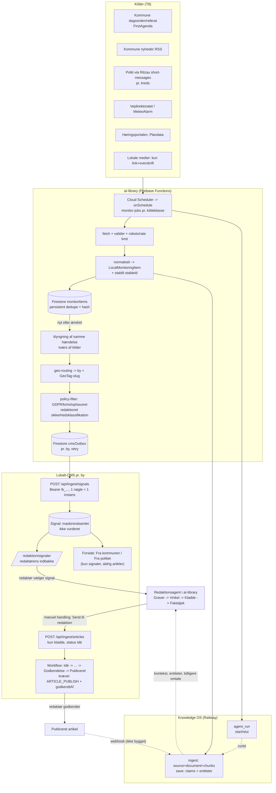

# T7 - Agent -> CMS-integration: end-to-end design

Dato: 2. oktober 2026. Status: designdokument (intet kodet i aI-library, Knowledge eller CMS). Bygger på `docs/review/AGENT-INGEST-API.md`, `FIX-sikkerhed-api.md`, `cms/lib/ingest/*`, aI-library (HEAD `166786f`) og de to øvrige rapporter: **T8** (kildematrix, scheduler) og **T9** (stabilisering). Hvor jeg henviser til kode, er det læst; intet er kørt mod produktion.

Princip (uændret fra CMS-kontrakten): **agenter leverer rå signaler og kladder, aldrig publiceret indhold.** Et menneske med `ARTICLE_PUBLISH` fører en kladde gennem workflowet. Alt maskinleveret er mærket.

---

## 1. Dataflow



Flow i ord:
1. Scheduler henter kilder (kadence i T8 afsnit 5), validerer svaret og normaliserer til `LocalMonitoringItem`.
2. Persistent dedupe afgør *nyt / ændret / set før*. Kun nye og ændrede elementer går videre.
3. Klyngning samler samme hændelse fra flere kilder til ét signal.
4. Geo-routing udpeger by(er) og GeoTag-slug. Policy-filteret fjerner/markerer persondata og afviser kilder uden afklaret licens.
5. Elementet lægges i en pr.-by **outbox** og sendes til CMS (`/api/ingest/signals`). Parallelt ingesteres kildeteksten i Knowledge OS under en `agent_run`.
6. Redaktøren ser signalet i indbakken, vurderer det og kan bede Redaktionsagenten om en kladde. Kladden sendes kun efter en manuel handling til `/api/ingest/articles` og lander som `Idé`.
7. Publicering sker udelukkende i CMS'et af et menneske. En (endnu ikke bygget) webhook kan returnere "publiceret/afvist" til Knowledge.

---

## 2. Adapter-modul i aI-library

Placering: `functions/cms/` (server-side; secrets må aldrig i browser, jf. T9). Hentelogikken i `functions/index.ts` (`fetchPoliceItems`, `fetchAgendaMentionItems` ...) trækkes ud i rene funktioner, så både callable og scheduler kan bruge dem.

```
functions/cms/
  types.ts           // CmsSignalInput, CmsArticleInput, CmsIngestResult (spejler cms/lib/ingest/schema.ts)
  routing.ts         // CITY_ROUTES + routeItemToCities()
  geo.ts             // GEO_TABLE (postnr/by -> GeoTag-slug), resolveGeoForCms()
  adapter.ts         // toCmsSignal(), mapSourceType(), buildExternalId(), sanitizeForCms()
  articleAdapter.ts  // toCmsArticleDraft()
  client.ts          // postSignals(), postArticleDraft(), cmsHealth()  (fetch + retry)
  outbox.ts          // enqueueSignal(), flushOutbox(cityKey)
  policy.ts          // assertSendable(): licens-, GDPR- og krimi-spærring
  cluster.ts         // incidentKey(), mergeIntoCluster()
functions/monitor/
  schedulers.ts      // onSchedule-eksporter pr. kildeklasse
  dedupe.ts          // monitorItems/monitorSources (Firestore)
functions/knowledgeIngest.ts   // ingestSignalToKnowledge(), startAgentRun(), finishAgentRun()
```

### 2.1 Typer (skal matche `cms/lib/ingest/schema.ts`)

```ts
export type CmsSourceType =
  | 'kommune_dagsorden' | 'politi' | 'beredskab_112' | 'trafik' | 'vejr'
  | 'forening' | 'klub' | 'lokalt_medie' | 'kommune_pressemeddelelse' | 'andet';

export interface CmsSignalInput {
  externalId: string;            // 1-200 tegn, stabil pr. kildeobjekt
  overskrift: string;            // 3-300
  braedtekst?: string;           // <= 20.000; HTML strippes af CMS
  kilde: string;                 // visningsnavn, <= 120
  kildeUrl: string;              // http(s)
  sourceType: CmsSourceType;
  geo?: string | { omraade?: string; postnr?: string; by?: string; kommune?: string };
  publishedAt?: string;          // ISO-8601
  meta?: Record<string, string | number | boolean | null>; // <= 20, GEMMES IKKE endnu
}
```

CMS-schemaet er `strict()`: ukendte felter (inkl. `breaking`, `notable`, `instansId`) giver 400/403. Adapteren må derfor aldrig sende ekstra felter.

### 2.2 Funktioner og mapping

```ts
toCmsSignal(item: LocalMonitoringItem, ctx: { cityKey: CityKey; runId: string }):
  { ok: true; signal: CmsSignalInput } | { ok: false; skip: 'no_url' | 'license' | 'no_city' | 'sensitive' }
```

| LocalMonitoringItem (functions/index.ts:1149) | CMS-signal | Regel |
|---|---|---|
| `id`, `source` | `externalId` | `buildExternalId()`, se 2.3 |
| `title` | `overskrift` | trim, 3-300; afvis ellers |
| `summary` | `braedtekst` | efter `sanitizeForCms()` (2.5); tom for headline-only kilder |
| `url` | `kildeUrl` | påkrævet; elementer uden URL sendes ikke |
| `sourceName` | `kilde` | fx "Midt- og Vestsjællands Politi" |
| `publishedAt` | `publishedAt` | ISO; tom hvis ukendt |
| `source` + kilde-publisher | `sourceType` | `mapSourceType()`, se nedenfor |
| `geographyLabel`, `postalCodes[0]`, `municipalityNames[0]` | `geo` | `resolveGeoForCms()`, se 2.4 |
| `category`, `deadline`, `geographyPrecision`, `municipalityCodes` | `meta` | skalarer; CMS gemmer dem ikke endnu, så brug dem ikke som eneste bærer af information |

`mapSourceType(item)`:

| aI-library `source` / kilde | CMS `sourceType` |
|---|---|
| `agenda_mentions` / dagsorden-/referat-punkt | `kommune_dagsorden` |
| kommune-RSS (Roskilde m.fl.), Ritzau-release fra kommunal afsender | `kommune_pressemeddelelse` |
| `police` (Ritzau short-messages, politi) | `politi` |
| brand/redning udledt af politi-/beredskabskilde | `beredskab_112` (CMS spærrer AI-udkast fra både `politi` og `beredskab_112`) |
| Vejdirektoratet | `trafik` |
| `weather`, `air_quality`, MeteoAlarm | `vejr` |
| `regional_news` (TV2 Øst m.fl.), sn.dk | `lokalt_medie` |
| foreningskilder | `forening` / `klub` |
| `plans`, `hearings`, `cvr`, `parliament`, `ritzau_releases`, `ritzau_announcements` | `andet` (kommunale høringer kan overvejes som `kommune_dagsorden`) |

**Bemærk:** `kommune_pressemeddelelse` og `kommune_dagsorden` er de eneste typer, "Fra kommunen"-modulet viser (cms/components/site/frontpage/data.ts:10-13). Planer og høringer med `andet` vises derfor aldrig på forsiden - det er en bevidst designbeslutning at tage.

### 2.3 `externalId`-regler

- Format: `<sourceType>:<sourceKey>:<stableId>`; maks 200 tegn (ellers hash den sidste del med sha1 og behold et læsbart præfiks).
- `stableId` er **kildens eget ID**, aldrig et array-index: Ritzau = tal i `guid`/URL (`/pressemeddelelse/15199572/...`); dagsorden = `<kommunekode>:<mødeId>:<punktId>`; RSS = `guid` eller normaliseret link; Høring = Atom `id`; trafik = DATEX `situationRecord id`; MeteoAlarm = CAP `identifier`.
- **Kendte svagheder i eksisterende id'er, der ikke må genbruges direkte:** `hearing-${id || index}` (functions/index.ts ~:1550) og politi `${guid || publisherId-index}` (~:1670) falder tilbage til index; luftkvalitet `air-${postnr}` er ens hver gang; regionale `reg-<feed>-<guid || title.slice(0,20)>`. Adapteren skal afvise/rekonstruere disse.
- Samme dagsordenpunkt har **samme `externalId` fra dagsorden til referat**, så CMS'et opdaterer signalet (version + 1) i stedet for at oprette dubletter.
- Samme element til flere byer bruger samme `externalId` (unikt pr. instans i CMS).
- Hændelsesklynger bruger `incident:<klyngeId>` som `externalId` for det samlede signal; de enkelte kilder noteres i `braedtekst`.

### 2.4 Geo-mapping til GeoTag

CMS `resolveGeo` matcher på **slug eller navn** i den pågældende instans; postnummer-fallback virker i praksis ikke (ingen GeoTag-navne indeholder postnr). Derfor:

1. `geo.ts` indeholder tabellen fra T8 afsnit 3.8: `postnr/by -> { cityKey, geoTagSlug }`.
2. Adapteren sender **altid** `geo: { omraade: '<præcis slug>', postnr, by, kommune }`. Slug først, så rammer CMS på `slug`-grenen.
3. Uden præcist match sendes kun `kommune`/`by`; CMS gemmer så `omraadeTekst` som tekst-hint (ingen fejl).
4. `routeItemToCities(item)`: `municipalityCodes` -> by (`0370 -> naestved`, `0330 -> slagelse`, `0316 -> holbaek`, `0259 -> koege`, `0265 -> roskilde`, `0329 -> ringsted`; `0326 -> kalundborg` mangler instans). Politi-feeds er pr. kreds og geo-filtreres på tekst (bynavn/postnr/vejnavn); er der ikke noget geo-match, **sendes elementet ikke** (kreds-bredt støj hører ikke hjemme i en bys indbakke).
5. Forslag til CMS (kræver ejerskab hos CMS-teamet): felt `GeoTag.postnumre`/`aliaser`, så postnr og bynavne kan matche uden slug-viden.

### 2.5 `sanitizeForCms()` og `policy.assertSendable()`

- `politi`, `beredskab_112`, retslister: send overskrift + højst ~300 tegn uddrag; fjern/maskér personnavne, alder + bopæl-kombinationer og køretøjsnumre; afvis elementer, hvor sigtede/anholdte er identificerbare. Politiets egen "(navn fjernet)" er et signal om, at det allerede er anonymiseret.
- Kilder med uafklaret licens (lokale medier, evt. kommuner): `braedtekst` tom, kun egen faktaoverskrift + link.
- Intet element sendes uden `kildeUrl`. Ingen kilde sendes som "breaking" (CMS afviser feltet alligevel).
- `policy.ts` er en deterministisk regelkontrol (ingen LLM) med log af hvert afslag.

### 2.6 Artikelkladder: `toCmsArticleDraft()`

```ts
toCmsArticleDraft(article: EditorialArticle, sources: SourceItem[], run: AgentRunInfo): CmsArticleInput
```

| Redaktionsagent / SourceItem (src/editorial/types.ts:96) | `POST /api/ingest/articles` |
|---|---|
| projekt + vinkel + version | `externalId = "redaktion:<projektId>:<vinkelId>:r<n>"` (ny revision = nyt id; CMS overskriver aldrig redaktørens version) |
| rubrik / underrubrik | `titel` (5-200) / `manchet` (<= 400) |
| brødtekst | `blocks`: `heading`, `paragraph`, `factbox`; **citater som `quote` med `kildeUrl` + `dato`** (påkrævet, ellers afviser CMS) |
| valgt sektion | `sektion` = kategori-slug i instansen; **må ikke være krimi/sundhed** (CMS: 403) |
| områder | `omraader: [geoTagSlug]` |
| hvad AI har gjort | `aiBrug`: mindst `Udkast`; `Omskrivning` hvis make-it-human kørte; `Sproglig korrektur` hvis korrektur |
| `SourceItem.sourceIdentifier` (URL), `date`, `title`, `publisher` | `sources[]: { url, dato, titel, udgiver, sourceType? }`; kilder uden URL udelades; hvis ingen kilder tilbage, **sendes kladden ikke** |
| signaler artiklen bygger på | `signalIds: [externalId, ...]` |
| agent + version + kørsels-id | `agent: { name: 'Redaktionsagent', version, runId: <Knowledge agentRunId> }` |
| faktatjek-resultat, artikel-hash | `meta` (skalarer) - gemmes i `provenance.meta` |

Pre-send-gates (alle skal være opfyldt, ellers knappen "Send til redaktion" er inaktiv):
1. Faktatjek er kørt med streng validering (T9 F02/F03) og dækningsgrad vist; ingen `unverified`-påstande uden menneskelig kommentar.
2. Hvert citat har kilde + dato; ingen opfundne citater (kontrol mod `rawContent`).
3. Ingen kilder af typen `politi`/`beredskab_112`; sektion er ikke krimi/sundhed (CMS håndhæver det alligevel).
4. En bruger har klikket manuelt; `sentBy` (som minimum session-id) og tidspunkt logges.

### 2.7 Klient og nøgler

- Én nøgle pr. by som Firebase-secret: `CMS_INGEST_KEY_NAESTVED`, `..._SLAGELSE`, `..._HOLBAEK`, `..._KOEGE`, `..._ROSKILDE`, `..._RINGSTED` (+ `..._KALUNDBORG`). Format `lk_...`; oprettes med `npm run ingest:key -- --domain naestvedlokalt.dk --name "aI-library / monitor" --scopes signals:write,health:read --expires-days 365` og kun med de scopes, der trænges.
- **To nøgler pr. by**: `monitor` (`signals:write`, `health:read`) og `redaktion` (`articles:draft`). Så kan en lækket scheduler-nøgle ikke oprette kladder.
- Base-URL pr. by = instansens domæne (`https://naestvedlokalt.dk` ...). Nøglen afgør instansen; adapteren sender aldrig `instansId` (giver 403).
- Rotation: opret ny nøgle -> opdatér secret -> deploy -> tilbagekald den gamle (`revokeIngestKeyAction`). Daglig `GET /api/ingest/health` pr. by: afslører udløbne/tilbagekaldte nøgler før de rammer produktion; alarm ved 401.
- Nøgler udløber maks. 365 dage; kalenderpåmindelse 30 dage før.

---

## 3. Fejl, genforsøg og idempotens

| Svar fra CMS | Betydning | Adapter-handling |
|---|---|---|
| 201 `created` / 200 `updated` / 200 `duplicate` | succes | outbox -> `sent`; gem `cmsId`, `version` |
| `rejected` i batch (`Intern fejl`) eller 500 | forbigående | genforsøg kun for de elementer, med backoff |
| 400 (validering, `issues[]`) | kontraktfejl | **ingen genforsøg**; dead-letter + alarm (bug i adapteren) |
| 401 | nøgle ugyldig/tilbagekaldt/udløbet | stop by-kø, alarm til ejer |
| 403 (scope, krimi/112-spærring, `instansId`) | politikbrud | dead-letter; ingen genforsøg |
| 413 | body for stor | del batchen (signaler 2 MB, artikler 1 MB) |
| 422 (forsøg på status/ukendt sektion) | kontraktfejl | dead-letter |
| 429 + `Retry-After` | rate limit | vent mindst `Retry-After`, bevar rækkefølge |
| netværk/timeout/5xx | forbigående | eksponentiel backoff 30 s -> 6 t med jitter, maks. 8 forsøg, derefter `dead` |

Idempotens-garantier (CMS): signaler deduper på `(instans, externalId)` og normaliseret `kildeUrl`; artikler på `(instans, externalId)` og overskriver aldrig. En gentaget kørsel er derfor sikker. aI-library skal alligevel have egen dedupe, så der ikke sendes unødige kald, og så **ændringer** (dagsorden -> referat) kan skelnes fra gentagelser. Batch: op til 100 signaler pr. kald, ét kald pr. kildecyklus og by.

Rate limits: CMS tillader 120 kald/min pr. nøgle og 30 fejlslagne forsøg/min pr. IP (429). Klienten holder sig på ~60/min med token bucket. **Produktion kræver delt rate-limit-store** (Redis via `REDIS_URL`; i dev proces-lokal) - ellers multipliceres grænserne pr. instans.

Outbox: Firestore `cmsOutbox/{cityKey}__{externalId}` med `{ payloadHash, status: pending|sent|failed|dead, attempts, nextAttemptAt, lastError, runId }`. Flush-job hvert minut pr. by.

---

## 4. Knowledge OS-sporet (provenance, entiteter, claims)

Krav til Knowledge (T9 afsnit 4): `POST /knowledge/agent-run`, `publishedAt` og `agentRunId` på ingest, dedupe på `(content_hash, url)`, batch-ingest, per-forbruger-nøgler.

Pr. kørsel:
1. `startAgentRun({ agentName: 'monitor-politi-naestved', agentVersion, model: null, input: { kilder, kadence } })` -> `runId`.
2. For hvert *nyt/ændret* element: `knowledge.ingest({ type: 'other'|'website', title, url, content: braedtekst/uddrag, publishedAt, metadata: { externalId, sourceType, cityKey, kommunekode, fetchedAt, runId } })`. Kun kilder med afklaret licens ingesteres som fuldtekst; ellers kun metadata + egen overskrift.
3. Efter policy-filteret: `knowledge.save` for *faktuelle påstande med kilde* (fx "Byrådet behandler lokalplan X den 7. okt.") med `entities` (sted, organisation; **ikke private personer**) og `derivedByAgentRunId = runId`, så origin = `derived`.
4. `finishAgentRun({ runId, status, nodesCreated, errors })`.
5. Samme `runId` følger med i CMS-kaldet (`agent.runId` på artikler; i `meta`/`braedtekst`-footer for signaler, indtil `meta` gemmes), så en redaktør kan spore en kladde tilbage til kørslen i Knowledge Explorer (`/knowledge/agent-runs`).

Knowledge er **ikke** kritisk sti: alle kald er non-blocking; fejl logges og retries via egen kø, aldrig blokering af CMS-leveringen (som README's connector-princip: "non-blocking, aldrig await'et af den kritiske sti").

Redaktionsagenten bruger Knowledge i forløbet: `knowledgeOS.search` (src/ai/tools.ts:781) finder tidligere omtale af sagen/personen/stedet og leverer kontekst som `SourceItem` (med `date`), som igen kan blive `sources[]` i kladden.

---

## 5. Hvad "Fra kommunen" og "Fra politiet" på forsiden henter

Forsidemodulerne `fra-kommunen` og `fra-politiet` (cms/lib/frontpage/modules.ts:310-350, komponent `FraKommunenPolitiet` i components/site/frontpage/dynamic.tsx:60) læser **direkte `Signal`-rækker**, ikke artikler og ikke en ekstern RSS-feed:

```
db.signal.findMany({ where: { instansId, maskinindsamlet: true, sourceType: { in: types } },
                     orderBy: [kildeTidspunkt desc, createdAt desc], take: slots })
```
(components/site/frontpage/data.ts:46-52). `types` = modulets `config.sourceTypes` eller standard `kommune_dagsorden`+`kommune_pressemeddelelse` (kommunen) hhv. `politi`+`beredskab_112` (politiet). Visningen er overskrift + kilde + klokkeslæt + eksternt link (`rel="noopener noreferrer nofollow"`), altid med mærket "Maskinindsamlet - ikke redaktionelt vurderet", aldrig AI-resumé; modulet skjules, når der ingen signaler er.

**Kritiske huller (skal lukkes, før modulerne tændes):**
1. **Ingen redaktionel godkendelse.** Signaler vises, så snart de er ingesteret. Skabelonen `fra-kommunen-politiet` opretter modulerne med `visible: true` (cms/lib/frontpage/templates.ts:27-35, 106-116), selvom T11/T12-specifikationen foreslår "skjult som standard og kræver opt-in" for politi/112 (spec afsnit "åbne spørgsmål" 5).
2. `config.omraadeSlug` er tilladt (modules.ts:326, 351), men **bruges ikke i forespørgslen**: forsiden viser alle områders signaler for instansen.
3. `maxAgeHours: 0` = ingen aldersgrænse; gamle politimeldinger kan stå fast.
4. Overskriften er en rå tekst fra kilden; en politimelding kan indeholde personoplysninger.

Anbefalede CMS-ændringer (ejes af CMS-teamet; ikke udført): `Signal.vurderet`/`tilForside` boolean, som redaktøren sætter (eller en whitelist-regel pr. kilde), `omraadeSlug`-filter, `maxAgeHours` (fx 24 t for politi), og at politi/112-modulet er `visible=false` som standard.

---

## 6. Faseplan

**Fase 0 - forudsætninger (før noget tændes)**: T9 P0/P1 (nøglerotation, DAWA-erstatning, Ritzau-`&`, Slagelse/Sorø-mapping, Knowledge fail-closed); CMS i produktion på Postgres med Redis-rate-limit-store; ingest-nøgler pr. by; licens-/ToS-afklaring pr. kilde; modulerne på forsiden `visible=false`; GeoTag-tabel (T8 afsnit 3.8) og manglende GeoTags.

**Fase 1 - pilot Næstved (3-4 uger, "shadow mode")**: kilder: kommune dagsorden/referat (0370), politi (Ritzau 90594, tekst-geo-filtreret), Vejdirektoratet (hvis adgang). Kun signaler til `/redaktion/signaler`; forsidemoduler skjult; ingen artikelkladder. Målepunkter: dublet-rate < 2 %, andel relevante signaler efter redaktørvurdering, forsinkelse kilde->CMS (< 10 min for politi), 0 hændelser med persondata på offentlige sider, scheduler-oppetid. Ugentlig gennemgang med redaktør.

**Fase 2 - Slagelse (inkl. Korsør, Skælskør, øerne)**: samme tre kilder; politi via 90594 (rettet mapping); GeoTags for Sørbymagle, Kirke Stillinge, Rude osv. Test, at `Antvorskov`-GeoTag-fejl i seed er rettet.

**Fase 3 - Holbæk, Køge, Roskilde, Ringsted**: Midt- og Vestsjællands Politi (13562881) deles af fire byer, så geo-routing på tekst er afgørende; Roskilde-RSS som første kommune-nyhedsfeed; høringer/planer via kommunefilter.

**Fase 4 - Kalundborg + kladder**: opret Kalundborg-instans/GeoTags/nøgler. Åbn `articles:draft` for Redaktionsagenten i **ikke-sensitive sektioner** (politik, kultur, erhverv, lokalt) efter pilotens målepunkter; forsidemodulerne tændes først, når signal-godkendelsesflaget findes.

**Fase 5 - feedback og læring**: webhook CMS -> Knowledge ved publicering/afvisning; redaktørens vurderinger kalibrerer prioriteringen ("Skriv/Følg/Fravalg" i lokalredaktoeren-koncept.md); lokale medier headline-only efter licens; foreninger/kultur.

Stopkriterier pr. fase: ethvert tilfælde af uredigeret personhenførbar politi-/112-tekst på en offentlig side, eller en kladde der kom forbi en spærring, stopper udrulningen, til årsagen er rettet.

---

## 7. Risici og tiltag

| Risiko | Konsekvens | Tiltag (eksisterende CMS-guardrail -> ekstra) |
|---|---|---|
| **Hallucination** (opfundne fakta/citater, jf. NewsBreak i overvågnings-strategidokumentet) | Falsk nyhed i kladde | CMS: kladde-only, `aiBrug` påkrævet, `sources[]` (url+dato) påkrævet, citater kræver `kildeUrl`+`dato`, `godkendtAf` tom blokerer publicering (`assertPublishableMarking`), ingen kodesti til `Publiceret`. Ekstra: streng faktatjek (T9 F02/F03), citatkontrol mod `rawContent`, signalfeltet er kun fakta fra kilden, ingen AI-resumé på forsiden |
| **Injurie / retsstilling** (krimi, 112, sigtede) | Erstatning, presseetik | CMS: AI-kladder spærret i Krimi og retsvæsen/Sundhed (`isAiRestrictedCategory`) og fra kilder af type `politi`/`beredskab_112` (403); signaler kan aldrig være `breaking`/`notable`. Ekstra: forsidemodul for politi skjult som standard; kun redaktionelt godkendte politi-signaler på offentlige sider; ingen navngivne sigtede; **hul:** en kladde uden `sektion` og uden politi-kilde passerer spærringen - kræv `sektion` på agentkladder |
| **GDPR / navne** | Behandling af personoplysninger uden grundlag; offentliggørelse | Dataminimering i `sanitizeForCms()`; ingen private personer som Knowledge-entiteter; retslister/CVR-ejere kun efter vurdering; sletterutine i `monitorItems` (TTL) og i Knowledge; log over hvem der sendte hvad; dokumenteret behandlingsgrundlag (journalistisk undtagelse kræver redaktionel behandling) |
| **Ophavsret / tredjepartstekst** | Krav fra medier (sn.dk, TV2 Øst forbyder AI-crawlere), kommuner, Ritzau | Kun link + egen faktaoverskrift for lokale medier; kort uddrag fra myndigheder først efter afklaring; aldrig fuldtekst i CMS-signal uden licens; Knowledge gemmer kun fuldtekst for afklarede kilder |
| **Kilder går ned/ændres** (Ritzau-`&`-fejl, DAWA 410, døde feeds) | Tavs "intet nyt" | Struktureret kildesundhed, alarm, dækningsrapport (T8 5.7); fejl er aldrig "0 resultater" |
| **Nøgle-lækage** | Spam/forurening af signalindbakke | Hashede nøgler i CMS, nøgle pr. by og pr. formål, scopes, udløb, rate limit, `lastUsedAt`, rotation (T9 afsnit 2) |
| **Redaktionel overbelastning** | Redaktør drukner i støj | Geo-filter, klyngning, prioritering, daglig kvote pr. kilde i pilot, "maskinindsamlet - ikke vurderet"-mærke og læst/ulæst; evaluér i pilot |
| **Autonom tilstand i aI-library** (standard `autonomous`, T9 #7) | Utilsigtet afsendelse | Afsendelse kun manuelt; "autonom" betyder kun autonom udarbejdelse |
| **Signal-opdatering overskriver uden at redaktøren ser det** | Ændret dagsordenpunkt overses | CMS: ved `updated` sættes `laest=false` (forslag), vis "version 2" i UI |
| **Proces-lokal rate limit/dedupe i CMS** | Grænser multipliceres ved flere instanser | Redis-store i produktion (CMS har `REDIS_URL`-understøttelse, jf. lib/ratelimit/index.ts) |

---

## 8. Opsummering af nødvendige ændringer pr. repo

**aI-library:** `functions/cms/*`, `functions/monitor/*`, `functions/knowledgeIngest.ts`; udtræk af hentefunktioner; DAWA-erstatning; Ritzau-fix; Slagelse/Sorø-fix; én kildekonfig; "Send til redaktion"-handling med pre-send-gates og `sentBy`-log; standardtilstand ikke autonom afsendelse.

**Knowledge:** fail-closed auth + scopes, `POST /knowledge/agent-run`, `publishedAt`/`agentRunId`/`metadata.externalId` på ingest, dedupe på `(content_hash, url)`, batch-ingest.

**CMS (forslag til CMS-ejeren, intet ændret af mig):** GeoTag-postnumre/aliaser; persistér `meta`; nulstil `laest` ved signal-opdatering; `Signal.vurderet`/forsidegodkendelse; `omraadeSlug`-filter og aldersgrænse i forsidemodulerne; politi-/112-modul skjult som standard; kræv `sektion` på agentkladder; "Opret kladde fra signal"-knap; webhook ved publicering; `GET`-endpoint for nøglestatus; delt rate-limit-store i produktion; UI til nøgleadministration (`/redaktion/ingest`, ikke bygget ifølge AGENT-INGEST-API.md afsnit 8).
